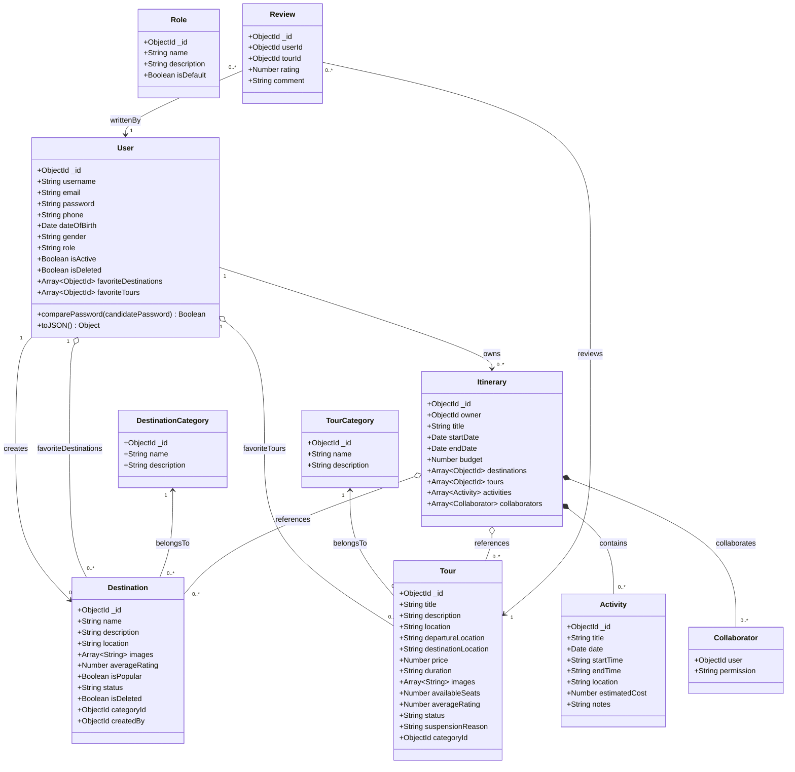

# Hướng Dẫn Sinh Biểu Đồ UML Chuẩn Hóa (Sequence & Class Diagram) - Dự Án TripMate

File này lưu trữ các quy chuẩn kỹ thuật, quy tắc đặt tên và các biểu đồ mẫu (Sequence Diagram, Class Diagram) được chuẩn hóa theo kiến trúc thực tế của dự án **TripMate** (React 19 SPA, Node.js/Express.js REST API, Mongoose ORM, MongoDB).

> **LƯU Ý QUAN TRỌNG:** Toàn bộ nội dung bên trong các biểu đồ Mermaid (tên thông điệp, hành động, điều kiện rẽ nhánh `[alt]`, dữ liệu trả về) **BẮT BUỘC PHẢI DÙNG TIẾNG ANH** chuẩn kỹ thuật phần mềm, không sử dụng tiếng Việt trong code biểu đồ.

---

## 1. Cấu Trúc Prompt (Câu Lệnh Mẫu) Khuyên Dùng

Khi bạn hoàn thành hoặc muốn mô hình hóa bất kỳ chức năng nào trong dự án, hãy copy và gửi câu lệnh sau:

> **"Hãy đọc kỹ file `UML_INSTRUCTIONS.md` và vẽ Sequence Diagram (Biểu đồ tuần tự) bằng mã Mermaid cho chức năng [TÊN CHỨC NĂNG, ví dụ: Login / Save Favorite Tour / Create Itinerary / Filter Tours]. Hãy tuân thủ đúng quy chuẩn: toàn bộ nội dung trong biểu đồ phải sử dụng TIẾNG ANH chuẩn kỹ thuật, ký hiệu Actor người que, Database hình trụ (Cylinder), biểu tượng quay đầu (self-call kèm stacked activation box), khung điều kiện `alt`, và dùng chính xác tên Component, API Service, Controller, Model trong mã nguồn TripMate."**

---

## 2. Tiêu Chuẩn Vẽ Biểu Đồ Sequence Diagram (Dành Cho AI & Báo Cáo)

Mọi biểu đồ tuần tự cho dự án TripMate phải tuân thủ nghiêm ngặt 6 nguyên tắc sau:

### 2.1. Ngôn Ngữ Trong Biểu Đồ (Diagram Content Language)
- **Toàn bộ văn bản hiển thị trong khối biểu đồ Mermaid (Sequence Diagram & Class Diagram) BẮT BUỘC dùng Tiếng Anh**:
  - Hành động người dùng: `1. Enter email & password, click "Login"`, `1. Click Heart icon on Tour Card [tourId]`.
  - Tên hàm & lời gọi: `validateForm(email, password)`, `user.comparePassword(password)`, `generateToken(user._id)`.
  - Điều kiện trong khung `alt`: `[Validation Failed - empty fields]`, `[User found & active]`, `[Role is Admin]`.
  - Dữ liệu phản hồi: `return HTTP 200 { success: true, token, user }`, `return user document / null`.
- Phần văn bản hướng dẫn và giải thích ngoài khối code giữ bằng Tiếng Việt để dễ theo dõi.

---

### 2.2. Phân Tầng Kiến Trúc & Quy Ước Đặt Tên Participant (Khớp 100% Source Code)
Tuyệt đối **không dùng** các thuật ngữ Java cũ (`Servlet`, `DAO`, `JSP`, `DBContext`, `SQLServer`). Biểu đồ phải phản ánh đúng các tầng của TripMate:

| Tầng | Cú pháp Mermaid | Ví dụ thực tế trong TripMate | Ghi chú |
| :--- | :--- | :--- | :--- |
| **Actor** | `actor [Tên]` | `actor Customer`<br>`actor Staff`<br>`actor Admin`<br>`actor TourProvider` | Tự động vẽ hình người que (stickman) ở hai đầu lifeline. |
| **View (React UI)** | `participant View as [PageName]` | `participant View as LoginPage`<br>`participant View as TourPage`<br>`participant View as ItineraryPage` | Giao diện người dùng tiếp nhận tương tác. **Tuyệt đối không để đuôi `.jsx`** (chỉ đặt tên trang sạch sẽ dạng `TourPage`, `LoginPage`). |
| **API Client Service** | `participant API as [apiService]` | `participant API as authApi`<br>`participant API as tourApi`<br>`participant API as itineraryApi` | Khai báo trong `frontend/src/services/api.js`. |
| **Express Middleware** | `participant MW as :[middlewareName]` | `participant MW as :authMiddleware` | Middleware xác thực JWT token (`protect`), validate dữ liệu. |
| **Express Controller** | `participant Ctrl as :[controllerName]` | `participant Ctrl as :authController`<br>`participant Ctrl as :tourController`<br>`participant Ctrl as :itineraryController` | Các file điều khiển trong `backend/src/controllers/`. |
| **Mongoose Model** | `participant Model as :[ModelName]` | `participant Model as :User`<br>`participant Model as :Tour`<br>`participant Model as :Itinerary` | Các schema/model trong `backend/src/models/`. |
| **Database** | `database DB as MongoDB` | `database DB as MongoDB` | Dùng từ khóa **`database`** để tự động hiển thị **biểu tượng hình trụ (Cylinder)**. |

---

### 2.3. Biểu Tượng Quay Đầu (Self-Call) & Hộp Kích Hoạt Lồng (Stacked Activation Box)
Khi một đối tượng tự gọi hàm nội bộ của chính mình (ví dụ: tự validate dữ liệu form, mã hóa mật khẩu, tạo token JWT, lưu dữ liệu vào localStorage):
- **Bắt buộc** phải có cặp `activate [Participant]` và `deactivate [Participant]` ngay sau mũi tên tự gọi để tạo ra **khối chữ nhật lồng bên phải (stacked activation bar)** đúng chuẩn UML trong ảnh mẫu FPT.
- Cú pháp mẫu:
  ```mermaid
  View->>View: 2. validateForm(email, password)
  activate View
  deactivate View
  ```

---

### 2.4. Khung Rẽ Nhánh Điều Kiện (`alt ... else ... end`)
- Sử dụng khối `alt [Condition]` và `else [Alternative Condition]` bằng tiếng Anh để mô tả các kịch bản kiểm tra dữ liệu:
  - Kiểm tra tính hợp lệ dữ liệu: `alt [Validation Failed - empty fields]` và `else [Validation Passed]`.
  - Kết quả truy vấn database: `alt [User not found or inactive]` và `else [User found & active]`.
  - Kiểm tra mật khẩu: `alt [Password Mismatch]` và `else [Password Matched]`.
  - Phân quyền điều hướng trang: `alt [Role is Admin / Staff / TourProvider]` và `else [Role is Customer]`.
- Cho phép lồng nhiều khung `alt` vào nhau (nested `alt`) để phản ánh đầy đủ logic nghiệp vụ.

---

### 2.5. Quy Chuẩn Mũi Tên & Đánh Số Thứ Tự
- `->>`: Mũi tên nét liền có đầu nhọn kín thể hiện lời gọi hàm đồng bộ / gửi request (Synchronous Call).
- `-->>`: Mũi tên nét đứt có đầu nhọn thể hiện phản hồi dữ liệu (Return Response).
- Mọi thông điệp đều phải được **đánh số thứ tự tăng dần liên tục**: `1. ...`, `2. ...`, `3. ...`.

---

### 2.6. Quy Tắc Vàng Trước Khung Rẽ Nhánh (Self-Call Before Alt - Chuẩn Báo Cáo Luận Văn)
Theo chuẩn báo cáo luận văn tốt nghiệp ngành Kỹ thuật Phần mềm (chuẩn Figure 72):
- **Tuyệt đối không** chuyển thẳng từ mũi tên trả về dữ liệu (Return Response `-->>`) vào ngay đường viền của khung `alt`!
- Trước khi mở khung `alt`, thành phần xử lý logic (Controller hoặc Service) **bắt buộc phải có một bước tự gọi (Self-Call)** để thực thi logic kiểm tra dữ liệu nhận được (ví dụ: `Check if tour is null or inactive`, tương ứng câu lệnh `if (!tour)` trong mã nguồn).
- Sau khi có bước tự gọi này, luồng mới chính thức rẽ nhánh vào các kịch bản: `alt [Condition Failed]` (trả lỗi về tận Client: `Display "..." message`) và `else [Condition Passed]` (tiến hành xử lý tiếp).

---

## 3. Biểu Đồ Mẫu 1: Đăng Nhập Hệ Thống (Login Flow)

Biểu đồ này mô tả chi tiết chức năng đăng nhập tài khoản của TripMate, bao gồm: kiểm tra dữ liệu đầu vào, truy vấn MongoDB, so khớp mật khẩu qua bcrypt, sinh JWT token và điều hướng theo vai trò người dùng (Role).

```mermaid
sequenceDiagram
    actor Customer
    participant View as LoginPage
    participant API as authApi
    participant Controller as :authController
    participant Model as :User
    database DB as MongoDB

    Customer->>View: 1. Enter email & password, click "Login"
    activate Customer
    activate View

    View->>View: 2. validateForm(email, password)
    activate View
    deactivate View

    alt Validation Failed (empty fields or invalid email format)
        View-->>Customer: 3. display validation error message on UI
    else Validation Passed
        View->>API: 4. authApi.login({ email, password })
        activate API

        API->>Controller: 5. POST /api/auth/login
        activate Controller

        Controller->>Model: 6. User.findOne({ email }).select('+password')
        activate Model

        Model->>DB: 7. findOne({ email })
        activate DB
        DB-->>Model: 8. return user document (with hashed password) / null
        deactivate DB

        Model-->>Controller: 9. return user instance / null
        deactivate Model

        alt User not found / isDeleted / isActive == false
            Controller-->>API: 10. return HTTP 401/403 (JSON Error: Invalid email or password)
            API-->>View: 11. throw Error(message)
            View-->>Customer: 12. toast.error("Invalid email or password")
        else User found & account is active
            Controller->>Model: 13. user.comparePassword(password)
            activate Model

            Model->>Model: 14. bcrypt.compare(password, this.password)
            activate Model
            deactivate Model

            Model-->>Controller: 15. return isMatch (true / false)
            deactivate Model

            alt Password Mismatch (Incorrect password)
                Controller-->>API: 16. return HTTP 401 (JSON Error)
                API-->>View: 17. throw Error(message)
                View-->>Customer: 18. toast.error("Invalid email or password")
            else Password Matched (Authentication successful)
                Controller->>Controller: 19. generateToken(user._id)
                activate Controller
                deactivate Controller

                Controller-->>API: 20. return HTTP 200 { success: true, token, user }
                deactivate Controller

                API->>API: 21. setAuthData(token, user) (save to localStorage)
                activate API
                deactivate API

                API-->>View: 22. return data { token, user }
                deactivate API

                View->>View: 23. setAuthUser(user) (update React AuthContext)
                activate View
                deactivate View

                alt Role is Admin / Staff / TourProvider
                    View-->>Customer: 24. navigate('/management') (redirect to Management Portal)
                else Role is Customer
                    View-->>Customer: 25. navigate('/') (redirect to Homepage)
                end
            end
        end
    end
    deactivate View
    deactivate Customer
```

---

## 4. Biểu Đồ Mẫu 2: Lưu Tour Yêu Thích (UC Save Favorite Tour)

Biểu đồ này mô tả chi tiết chức năng lưu tour vào danh sách yêu thích của Customer (tiền điều kiện: Customer đã đăng nhập). Luồng chuẩn luận văn (khớp Figure 72): Khách click tim trên Card mang theo `[tourId]` -> View gọi thẳng API `tourApi.saveFavorite(tourId)` -> lấy Bearer token qua `authMiddleware` xác thực -> Controller truy vấn MongoDB -> Model trả kết quả về Controller -> Controller tự gọi `Check if tour is null or inactive` -> rẽ nhánh `alt` (nếu không thấy thì báo lỗi 404 về tận Actor; nếu tìm thấy thì cập nhật MongoDB bằng `$addToSet`, phản hồi 200 và cập nhật tim đỏ trên giao diện).

```mermaid
sequenceDiagram
    actor Customer
    participant View as TourPage
    participant API as tourApi
    participant MW as :authMiddleware
    participant Controller as :tourController
    participant TourModel as :Tour
    participant UserModel as :User
    database DB as MongoDB

    Customer->>View: 1. Click Heart icon on Tour Card [tourId]
    activate Customer
    activate View

    View->>API: 2. tourApi.saveFavorite(tourId)
    activate API

    API->>API: 3. getToken() from Storage & attach Bearer token
    activate API
    deactivate API

    API->>MW: 4. POST /api/tours/:id/favorite (Header: Authorization: Bearer <token>)
    activate MW

    MW->>MW: 5. jwt.verify(token, JWT_SECRET)
    activate MW
    deactivate MW

    MW->>Controller: 6. saveFavoriteTour(req, res)
    activate Controller
    deactivate MW

    Controller->>TourModel: 7. Tour.findOne({ _id: tourId, status: 'active' })
    activate TourModel

    TourModel->>DB: 8. findOne({ _id: tourId, status: 'active' })
    activate DB
    DB-->>TourModel: 9. Return tour document / null
    deactivate DB

    TourModel-->>Controller: 10. Return tour / null
    deactivate TourModel

    Controller->>Controller: 11. Check if tour is null or inactive
    activate Controller
    deactivate Controller

    alt [Tour Not Found or Inactive]
        Controller-->>API: 12. Return HTTP 404 (Tour not found)
        API-->>View: 13. Throw Error("Tour not found")
        View-->>Customer: 14. Display "Tour not found" message
    else [Tour Found & Active]
        Controller->>UserModel: 15. User.findByIdAndUpdate(userId, { $addToSet: { favoriteTours: tourId } })
        activate UserModel

        UserModel->>DB: 16. updateOne({ _id: userId }, { $addToSet: { favoriteTours: tourId } })
        activate DB
        DB-->>UserModel: 17. Return write result
        deactivate DB

        UserModel-->>Controller: 18. Return user updated
        deactivate UserModel

        Controller-->>API: 19. Return HTTP 200 { success: true, message: 'Saved to favorites', tourId, isFavorite: true }
        deactivate Controller

        API-->>View: 20. Return response data
        deactivate API

        View->>View: 21. update favoriteTourIds state (add tourId to Set)
        activate View
        deactivate View

        View-->>Customer: 22. Display "Tour saved to favorites" message & update heart icon to red
    end
    deactivate View
    deactivate Customer
```

---

## 5. Biểu Đồ Mẫu 3: Tạo Lịch Trình Cá Nhân (Protected Itinerary Flow)

Biểu đồ này mô tả quy trình tạo lịch trình có đi qua tầng xác thực quyền hạn **`authMiddleware.protect`** bằng JWT Bearer Token trước khi tới Controller và Database.

```mermaid
sequenceDiagram
    actor Customer
    participant View as ItineraryPage
    participant API as itineraryApi
    participant MW as :authMiddleware
    participant Controller as :itineraryController
    participant Model as :Itinerary
    database DB as MongoDB

    Customer->>View: 1. Enter title, budget, click "Create Itinerary"
    activate Customer
    activate View

    View->>View: 2. validateForm(title, budget)
    activate View
    deactivate View

    View->>API: 3. itineraryApi.create({ title, budget })
    activate API

    API->>API: 4. getToken() from Storage & attach Bearer Token
    activate API
    deactivate API

    API->>MW: 5. POST /api/itineraries (Header: Authorization: Bearer <token>)
    activate MW

    MW->>MW: 6. jwt.verify(token, JWT_SECRET)
    activate MW
    deactivate MW

    alt Invalid or Expired Token
        MW-->>API: 7. return HTTP 401 (Not authorized, token failed)
        API-->>View: 8. throw Error(message)
        View-->>Customer: 9. prompt login required
    else Token Valid
        MW->>MW: 10. attach authenticated user to req.user & call next()
        activate MW
        deactivate MW

        MW->>Controller: 11. createItinerary(req, res)
        activate Controller
        deactivate MW

        Controller->>Model: 12. Itinerary.create({ owner: req.user._id, title, budget })
        activate Model

        Model->>DB: 13. insertOne(itineraryDocument)
        activate DB
        DB-->>Model: 14. return created itinerary document
        deactivate DB

        Model-->>Controller: 15. return newItinerary instance
        deactivate Model

        Controller-->>API: 16. return HTTP 201 { success: true, itinerary: newItinerary }
        deactivate Controller

        API-->>View: 17. return response data
        deactivate API

        View->>View: 18. update itineraries state & setSelected
        activate View
        deactivate View

        View-->>Customer: 19. toast.success("Itinerary created successfully") & render details
    end
    deactivate View
    deactivate Customer
```

---

## 6. Tiêu Chuẩn Vẽ Class Diagram (Biểu Đồ Lớp Dữ Liệu)

Khi vẽ Class Diagram cho TripMate, sử dụng cú pháp Mongoose Schemas chuyển sang UML Classes chuẩn FPT:
- **Association (`-->`)**: Mối quan hệ tham chiếu `ObjectId` (ví dụ: `Destination` tham chiếu `DestinationCategory`).
- **Composition (`*--`)**: Mối quan hệ chứa đựng chặt chẽ (Sub-documents như `Activity` và `Collaborator` nằm trong `Itinerary`).
- **Aggregation (`o--`)**: Mối quan hệ tập hợp (ví dụ: `User` chứa danh sách mảng ID của `favoriteDestinations` và `favoriteTours`).



---

## 7. Hướng Dẫn Sử Dụng & Xuất Biểu Đồ

### 7.1. Sử Dụng Trực Tiếp Trên Draw.io (Khuyên Dùng Cho Báo Cáo)
1. Mở ứng dụng hoặc trang web **[Draw.io](https://app.diagrams.net)**.
2. Trên thanh menu, chọn: **Arrange > Insert > Advanced > Mermaid...** (hoặc tiếng Việt: **Thao tác > Chèn > Nâng cao > Mermaid...**).
3. Sao chép toàn bộ khối mã nằm giữa cặp dấu ba backtick (` ```mermaid ... ``` `) ở trên, dán vào khung nhập liệu rồi nhấn nút **Insert**.
4. **Cách biến Database thành hình trụ chuẩn:**
   - Sau khi Draw.io hiển thị sơ đồ, hãy click chuột vào ô hình chữ nhật `:MongoDB`.
   - Nhìn sang thanh công cụ **Style** ở cạnh phải màn hình, tìm mục **Shape** (hoặc tìm biểu tượng hình trụ trong thư viện hình vẽ) và click chọn **Cylinder** (Hình trụ). Ô Database sẽ lập tức đổi sang hình trụ chuẩn công nghệ phần mềm!

### 7.2. Xem Nhanh & Tải Ảnh Bằng Mermaid Live Editor
1. Truy cập trang web: **[https://mermaid.live](https://mermaid.live)**.
2. Dán đoạn mã Mermaid vào khung bên trái.
3. Xem biểu đồ trực quan được render ngay lập tức ở khung bên phải.
4. Nhấn nút **Actions > Download PNG** hoặc **Download SVG** để tải ảnh vector sắc nét đưa vào tài liệu báo cáo dự án.

### 7.3. Xem Trực Tiếp Trong VS Code
- Cài đặt extension: **"Markdown Preview Mermaid Support"** (của tác giả Matt Bierner).
- Mở file `.md` bất kỳ chứa mã Mermaid và bấm `Ctrl + Shift + V` (hoặc click icon Preview góc trên bên phải) để xem biểu đồ trực tiếp trong trình soạn thảo.
