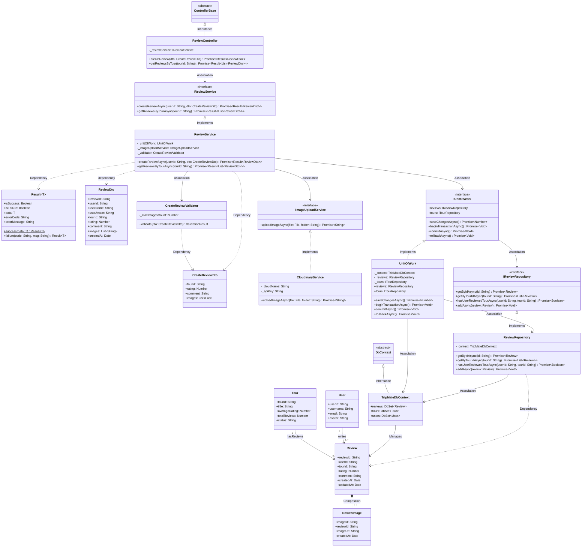
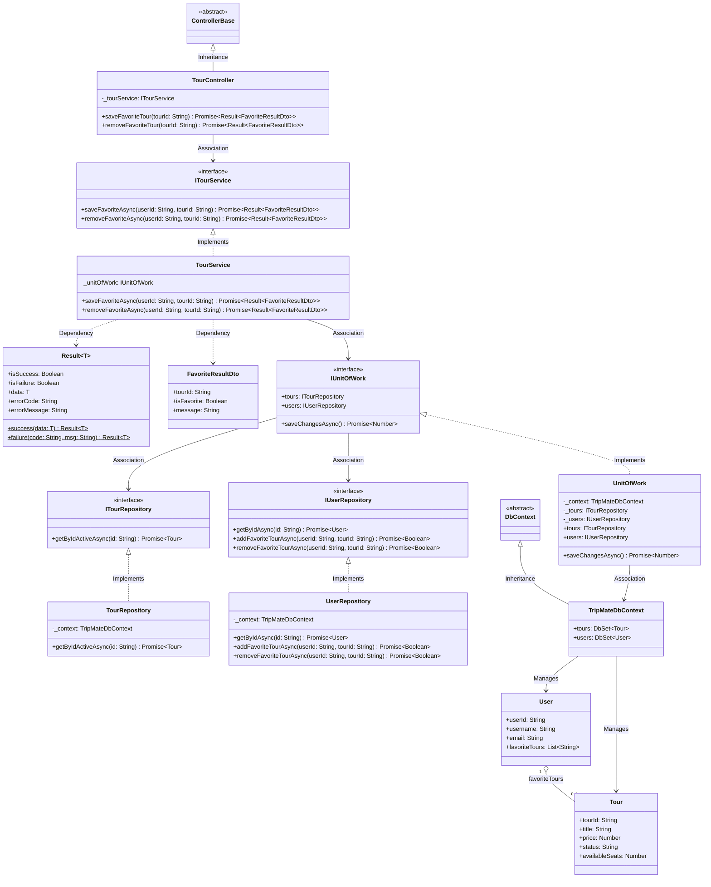

# Hướng Dẫn Sinh Biểu Đồ Lớp Chi Tiết Chuẩn Hóa (Design Class Diagram - DCD)
## Dự Án TripMate - Chuẩn Báo Cáo Luận Văn Tốt Nghiệp FPT

File này lưu trữ toàn bộ quy chuẩn kỹ thuật, cấu trúc phân tầng, cú pháp Mermaid và biểu đồ mẫu để AI Agent và sinh viên sinh ra **Design Class Diagram (DCD - Biểu đồ lớp cấp độ thiết kế chi tiết)** bám sát 100% theo form mẫu báo cáo luận văn tốt nghiệp ngành Kỹ thuật Phần mềm (chuẩn mẫu đồ án SEPRP01).

> **LƯU Ý QUAN TRỌNG:**
> 1. Toàn bộ nội dung bên trong biểu đồ Mermaid (tên lớp, interface, thuộc tính, phương thức, kiểu dữ liệu, quan hệ) **BẮT BUỘC PHẢI DÙNG TIẾNG ANH** chuẩn kỹ thuật OOP.
> 2. Biểu đồ lớp ở cấp độ thiết kế chi tiết (DCD) phải thể hiện đầy đủ các tầng kiến trúc: **Controller -> DTO -> Service Interface -> Service Impl -> UnitOfWork -> Repository Interface -> Repository Impl -> DbContext -> Entity**.

---

## 1. Cấu Trúc Prompt Mẫu Dùng Để Yêu Cầu AI Vẽ Class Diagram

Khi cần vẽ Class Diagram cho bất kỳ chức năng nào trong dự án TripMate, hãy copy và gửi câu lệnh sau:

> **"Hãy đọc kỹ file `CLASS_DIAGRAM_INSTRUCTIONS.md` và mã nguồn dự án TripMate để vẽ Design Class Diagram (Biểu đồ lớp chi tiết) bằng mã Mermaid cho chức năng [TÊN CHỨC NĂNG, ví dụ: Tour Review / Destination Management / Favorite Tours / Tour Booking]. Hãy tuân thủ nghiêm ngặt chuẩn luận văn: đầy đủ các tầng Controller, Service Interface, Service Implementation, Repository Interface, Repository Implementation, UnitOfWork, DbContext, Entities, DTOs; sử dụng chính xác các quan hệ Inheritance (--|>), Implementation (..|>), Association (-->), Dependency (..>); 100% tiếng Anh kỹ thuật."**

---

## 2. Phân Tầng Kiến Trúc Class Diagram Chuẩn Luận Văn (Clean Architecture)

Dựa trên ảnh mẫu luận văn thực tế, một biểu đồ lớp chi tiết cho một ca sử dụng bao gồm 8 nhóm lớp (Stereotypes) sau:

| Tầng / Nhóm Lớp | Stereotype / Quy ước | Vai trò trong hệ thống | Ví dụ thực tế trong TripMate |
| :--- | :--- | :--- | :--- |
| **1. Base Controller** | `class ControllerBase` | Lớp cơ sở của toàn bộ API Controllers | `ControllerBase` |
| **2. Feature Controller** | `class [Feature]Controller` | Tiếp nhận HTTP Request, gọi Service qua Interface | `ReviewController`<br>`TourController`<br>`DestinationController` |
| **3. DTO (Data Transfer Objects)** | `class [Name]Dto`<br>`class [Name]Request`<br>`class Result~T~` | Đóng gói dữ liệu đầu vào và đầu ra, lớp bọc kết quả | `CreateReviewDto`<br>`ReviewDto`<br>`Result~T~` |
| **4. Validator** | `class [Name]Validator` | Kiểm tra tính hợp lệ của DTO đầu vào | `CreateReviewValidator` |
| **5. Service Layer** | `<<interface>> I[Feature]Service`<br>`class [Feature]Service` | Chứa toàn bộ Business Logic nghiệp vụ | `IReviewService`<br>`ReviewService` |
| **6. External Gateways / Helpers** | `<<interface>> I[Name]Service`<br>`class [Name]Service` | Tương tác dịch vụ thứ 3 (Upload ảnh Cloudinary, JWT, Email) | `IImageUploadService`<br>`CloudinaryService`<br>`ITokenService` |
| **7. Data Access Layer (UoW & Repo)** | `<<interface>> IUnitOfWork`<br>`class UnitOfWork`<br>`<<interface>> I[Entity]Repository`<br>`class [Entity]Repository` | Quản lý Transaction và truy vấn dữ liệu độc lập | `IUnitOfWork` / `UnitOfWork`<br>`IReviewRepository` / `ReviewRepository` |
| **8. Database Context & Entities** | `class DbContext`<br>`class TripMateDbContext`<br>`class [Entity]` | Quản lý kết nối Database và các thực thể dữ liệu gốc | `TripMateDbContext`<br>`Review`, `Tour`, `User`, `ReviewImage` |

---

## 3. Quy Chuẩn Ký Hiệu Thuộc Tính & Phương Thức (Visibility & Types)

### 3.1. Ký hiệu phạm vi truy cập (Visibility)
* `+` : **Public** (Truy cập công khai - thường dùng cho methods của Controller, Service, Repository, DTO fields).
* `-` : **Private** (Thuộc tính nội bộ - dùng cho các trường dependencies inject vào Controller, Service, Repository, ví dụ: `-_unitOfWork`, `-_context`).
* `#` : **Protected** (Dùng cho kế thừa).

### 3.2. Định dạng khai báo
* **Thuộc tính (Attribute):** `[Visibility][name]: [Type]`
  * Ví dụ: `+reviewId: String`, `+rating: Number`, `-_reviewService: IReviewService`
* **Phương thức (Method):** `[Visibility][MethodName]([param]: [Type]): [ReturnType]`
  * Ví dụ: `+createReview(dto: CreateReviewDto): Promise~Result~ReviewDto~~`

---

## 4. Bảng Quy Chuẩn Mối Quan Hệ Giữa Các Lớp (UML Relationships)

| Mối quan hệ | Cú pháp Mermaid | Ký hiệu hình vẽ | Khi nào áp dụng? |
| :--- | :---: | :---: | :--- |
| **Kế thừa (Inheritance)** | `BaseClass <\|-- SubClass` | Mũi tên tam giác rỗng nét liền | `ControllerBase <\|-- ReviewController`<br>`DbContext <\|-- TripMateDbContext` |
| **Thực thi giao diện (Implementation)** | `Interface <\|.. Implementation` | Mũi tên tam giác rỗng nét đứt | `IReviewService <\|.. ReviewService`<br>`IUnitOfWork <\|.. UnitOfWork`<br>`IReviewRepository <\|.. ReviewRepository` |
| **Liên kết sử dụng (Association)** | `ClassA --> ClassB` | Mũi tên mở nét liền | Controller giữ Service (`ReviewController --> IReviewService`)<br>Service giữ UnitOfWork (`ReviewService --> IUnitOfWork`) |
| **Phụ thuộc (Dependency)** | `ClassA ..> ClassB` | Mũi tên mở nét đứt | Service phụ thuộc vào DTO làm tham số/kết quả (`ReviewService ..> CreateReviewDto`)<br>Validator phụ thuộc DTO (`Validator ..> DTO`) |
| **Hợp thành chặt chẽ (Composition)** | `ClassA *-- ClassB` | Hình thoi đen đặc | Entity sở hữu Sub-entity (`Review *-- ReviewImage`) |
| **Thu nạp lỏng lẻo (Aggregation)** | `ClassA o-- ClassB` | Hình thoi trắng rỗng | Entity chứa danh sách tham chiếu (`User o-- Review`) |

---

## 5. Biểu Đồ Lớp Thiết Kế Mẫu 1: Chức Năng Đánh Giá Tour (UC Tour Review)
*(Khớp chính xác cấu trúc mẫu Image 1 của ĐH FPT)*



---

## 6. Biểu Đồ Lớp Thiết Kế Mẫu 2: Chức Năng Lưu Tour Yêu Thích (UC Save Favorite Tour)



---

## 7. Hướng Dẫn Sử Dụng Vẽ Biểu Đồ Trên Draw.io & Báo Cáo

### 7.1. Nhập vào Draw.io & Thiết lập Màu Trắng Chuẩn Luận Văn (Pure White)
* **Tại sao Mermaid mặc định lại có màu tím?**
  * Do Mermaid sử dụng theme mặc định (`theme: 'default'`) với mã màu nền tím nhạt (`#ECECFF`) và viền tím đậm.
* **Tại sao bấm đổi màu trên Draw.io không có tác dụng?**
  * Khi chèn từ Mermaid, Draw.io coi sơ đồ là một **đối tượng nhúng SVG nguyên khối (Dynamic Mermaid Object)**. Style màu tím đã bị khóa cứng (hardcoded) bên trong SVG, thanh **Style** ở cạnh phải chỉ đổi màu khung ngoài của toàn bộ sơ đồ chứ không tác động vào từng ô bên trong.

* **Cách khắc phục triệt để:**
  1. **Cách 1: Khai báo Theme Trắng Tinh (Pure White) ngay đầu khối Mermaid (Khuyên Dùng):**
     Luôn luôn đặt đoạn khởi tạo sau ở dòng đầu tiên của mọi khối mã `classDiagram`:
     ```mermaid
     %%{init: {
       'theme': 'base',
       'themeVariables': {
         'primaryColor': '#ffffff',
         'primaryTextColor': '#000000',
         'primaryBorderColor': '#000000',
         'lineColor': '#333333',
         'secondaryColor': '#ffffff',
         'tertiaryColor': '#ffffff'
       }
     }}%%
     classDiagram
     ...
     ```
  2. **Cách 2: Rã nhóm (Ungroup) trong Draw.io để đổi màu thủ công bằng chuột:**
     - Click chọn cả khối sơ đồ.
     - Nhấn phím tắt **`Ctrl + Shift + U`** (hoặc chuột phải chọn **Ungroup** / Menu: **Arrange > Ungroup**) từ 1 đến 2 lần.
     - Sơ đồ sẽ rã thành các hình khối hình chữ nhật chuẩn của Draw.io.
     - Bạn click chọn ô bất kỳ -> nhìn sang bảng **Style** bên phải -> chọn màu **Fill: White (#FFFFFF)** tùy ý!

### 7.2. Xuất ảnh chất lượng cao:
- Chọn **File > Export as > PNG (DPI: 300)** hoặc **SVG**, tick chọn *Transparent Background* để đưa vào bài Word báo cáo luận văn sắc nét không bị vỡ chữ.
